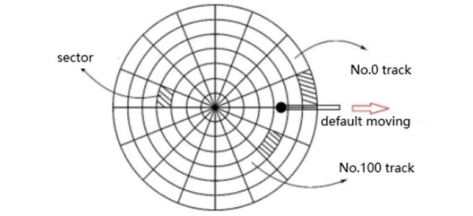

# Submit

| Content    | File | Grades | Remarks |
| ---------- | ------ | ------ | ------ |
| Report | [Report8.md](./Report8.md) | 55/60  | Q4 Grades 25/30  |
| Code | [CLOOK.cpp](./CLOOK.cpp) | 40/40 |   |

 

# Disk Scheduling Task

## Problem Description

The structure of disk is shown as follows, the track No. start from outer to inner (the outset track is No.0 track). And the default moving direction of head is from inner to outer. Complete C-LOOK algorithms. Return the visiting sequence of tracks and calculate the total moving distance.

**Input**:

First Line: S(0<=S<M), M(0<M<=65536) and N(0>n>M)

+   S represents the position of beginning track.
+   M represents the total number of tracks in disk.
+   N represents the number of scheduling requests.

Second Line: N integers

+   Represent the track number that needs requesting.

**Output**:

First Line: the visiting sequence of tracks

Second Line: the total moving distance

**Input Example**:
50 200 8
95 180 34 119 11 123 62 64

**Output Example**:
50 34 11 180 123 119 95 64 62
326
