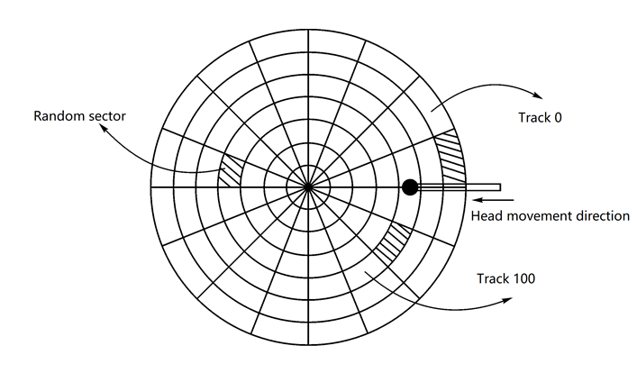

# Report8

## Q1

1.  I/O control methods can be classified as (1) \_\_\_\_  (2) \_\_\_\_
2.  Each physical record on the disk has a unique address that consists of three parts: (1) \_\_\_\_  (2) \_\_\_\_  (3) \_\_\_\_
3.  Data READ/WRITE time = (1) \_\_\_\_  +  (2) \_\_\_\_  +  (3) \_\_\_\_
4.  The metric for measuring I/O performance are (1) \_\_\_\_  (2) \_\_\_\_

>   1.  (1)  Programmed IO (2) DMA (Direct Memory Access)
>
>   2.  (1) Head identifier (2) Track identifier (3) Sector identifier
>
>   3.  (1)  Seek time (2)  Rotational delay ( or rotational latency ) (3)  Transfer time
>
>   4.  (1)  Response Time  (2) Throughput

## Q2

What are the work steps of the DMA controller? Please answer it and briefly describe the process of each step

>   1.  device driver is told by CPU to transfer disk data to buffer at address X.
>   2.  device driver tells disk controller to transfer C bytes from disk to buffer at address X.
>   3.  disk controller initiates DMA transfer.
>   4.  disk controller sends each byte to DMA controller.
>   5.  DMA controller transfers bytes to buffer X, increasing memory address and decreasing C until C = 0.
>   6.  when C = 0, DMA interrputs CPU to signal transfer completion.

## Q3

 Under what circumstance, the SSTF algorithm will cause starvation?

>   如果等待队列中有一个距离当前磁道比较远的磁道的请求在等待，但是不断地有距离当前磁道距离较近的磁道访问请求产生，此时SSTF算法会不断访问距离较近的磁道，距离较远的磁道请求一直得不到响应，此时饥饿产生。

## Q4

Suppose the computer system uses the disk as the following:

Let a single-sided disk rotation speed be 12000r/min, each track has 100 sectors, 200 tracks in total, and the average movement time between adjacent tracks is 1 ms.

If at some point, the head is located at track 100 and moves in the direction in which the track number increases, the track number request queue is 70, 90, 30, 120, 20, 60. For each track in the request queue, a randomly distributed sector is read.

a).  If the C-SCAN algorithm is used to read the six sectors,
    (1)   Write the track access sequence (5 points)
    (2)   How much time is required in total? The calculation process is required. (15 points).
b).  If using SSD, which scheduling algorithm do you think should be used, and explain   why? (10 points)

**Grade  25/30**

>   a)
>
>   (1) 120, 20, 30, 60, 70, 90
>
>   (2)  12000 r/min --> 5 ms/r
>
>   轨道调整 100-->120-->199-->0-->20-->30-->60-->70-->90 总耗时: 20+79+199+20+10+30+10+20 = 388 ms
>
>   从当前扇区移动到目标扇区最长耗时：2.5 ms
>
>   寻找扇区总耗时：2.5 * 6 = 15 ms
>
>   总耗时：388 + 15 = 403 ms
>
>   
>
>   b)
>
>   使用 First Come-First Serve (FCFS) 算法。
>
>   因为SSD可以做到无寻道或旋转延迟的随机访问，这时候应该考虑请求的顺序保证公平，防止饥饿的发生。

## 

Corrected answer:

>   a)
>
>   (1) 120, 20, 30, 60, 70, 90
>
>   (2)  12000 r/min --> 5 ms/r
>
>   轨道调整 100-->120-->199-->0-->20-->30-->60-->70-->90 总耗时: 20+79+199+20+10+30+10+20 = 388 ms
>
>   ~~从当前扇区移动到目标扇区最长耗时：2.5 ms~~
>
>   从当前扇区移动到目标扇区的耗时（期望值）：2.5 ms
>
>   寻找扇区总耗时：2.5 * 6 = 15 ms
>
>   总耗时：388 + 15 = 403 ms
>
>   
>
>   b)
>
>   使用 First Come-First Serve (FCFS) 算法。
>
>   因为SSD可以做到无寻道或旋转延迟的随机访问，这时候应该考虑请求的顺序保证公平，防止饥饿的发生。

期望值 通过求积分可获得